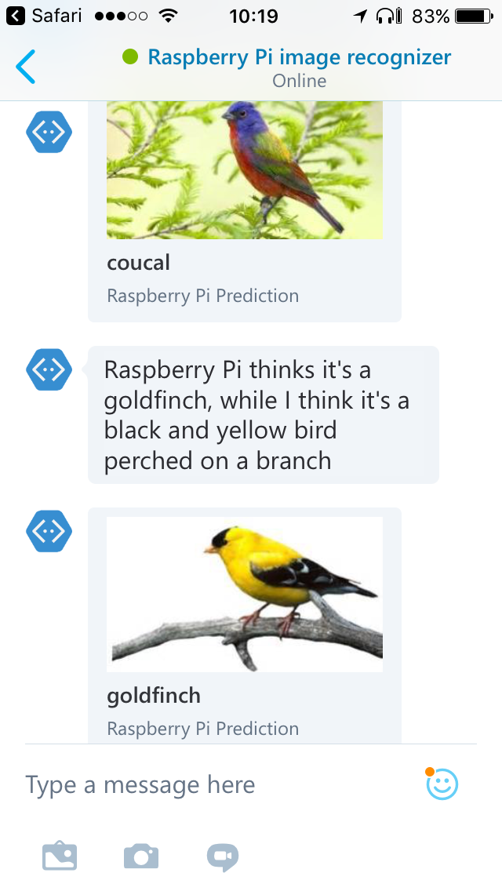

# Embedded Learning Bot


This project contains instructions for building a Bot that connects to a Raspberry Pi device running the [Embedded Learning Library (ELL)](https://github.com/Microsoft/ELL) to recognize the content of images from web searches.

ELL allows running full-fledged artificial neural networks on embedded devices (see article [Microsoft Research Shows Embedded AI on Bread-Crumb Sized Processor](https://winbuzzer.com/2017/06/30/microsoft-research-shows-embedded-ai-bread-crumb-sized-processor-xcxwbn/)).
In this demo we use the [Darknet](https://pjreddie.com/darknet/imagenet/) open-source image classifier, trained to recognize 1000 object classes.



## License

See [LICENSE.txt](LICENSE.txt).

## Code of conduct

This project has adopted the [Microsoft Open Source Code of Conduct](https://opensource.microsoft.com/codeofconduct/). For more information on this code of conduct, see the [Code of Conduct FAQ](https://opensource.microsoft.com/codeofconduct/faq/) or contact [opencode@microsoft.com](mailto:opencode@microsoft.com) with any additional questions or comments.

## Build and Installation Instructions

### Requirements

* A Raspberry Pi 3
* A power adapter for the Raspberry Pi
* A micro SD card for the Raspberry Pi
* A wifi adapter for the Raspberry Pi (unless connected by wire)
* A Windows or Linux computer with an SD slot

### Getting started

* Use Noobs to install Raspbian on a micro SD card.
* Add an empty file called "ssh" to the root of the SD card, otherwise you won't be able to ssh to the device.
* SSH to the device. The default password is raspberry
```bash
  ssh pi@raspberrypi
```

* Install xrdp to allow us to open a Remote Desktop connection onto the device. The extra instructions are to fix a glitch with tightvncserver.
```bash
  sudo apt-get update
  sudo apt-get remove vnc4server tightvncserver
  sudo apt-get install tightvncserver
  sudo apt-get install xrdp
```

* Enable NTP to automatically synchronise the time on the device (otherwise HTTPS connections to Azure will fail after a while because of time drift)
```bash
  sudo apt-get install ntpdate
  sudo reboot
```

### Installing ELL and demo code

* Complete the installation instructions of the tutorial in the [ELL](https://github.com/Microsoft/ELL) project, on Linux or Windows. Compile the Darknet model on the Raspberry Pi.
* Add the remoteDemo.py and remoteDemoHelper.py files from the device directry of this project into the compiled_darknetReference_pi3 folder on your Raspberry Pi
* Install additional dependencies on the Raspberry Pi:

```bash
  source activate py34
  conda install requests
  sudo apt-get install libffi-dev libssl-dev
  git clone git://github.com/Azure/azure-storage-python.git
  cd azure-storage-python/
  python setup.py install
  sudo apt-get install ntpdate
  sudo reboot
```

* In Azure, create a Cognitive service of type "Bing Image Search" and copy the access key.

* Connect via RDP to the Raspberry Pi. Run the remoteDemo.py, passing the keys as environment variables, e.g.:
```bash
  source activate py34
  BING_IMAGE_SEARCH_KEY=b34931b141ab14jk341hba9python remoteDemo.py
```

At this stage the Raspberry Pi will download images of dogs from Bing Image Search and apply the Darknet model to recognize their content.


### Creating a bot

* In Azure, create a Cognitive service of type "Computer Vision API" and copy the access key.
* Create an Azure Bot with language C# and of type "Proactive Bot".
* In Azure, locate the Storage account that was automatically created when your bot was deployed and copy the access key.

* On the Raspberry Pi, run the remoteDemo.py again, passing the extra keys as environment variables, e.g.:
```bash
  BING_IMAGE_SEARCH_KEY=b34931b141ab14jk341hba9d71362723 STORAGE_KEY='Sm8kbjk1rewl1+TgTCE3Qo+/Yojqkrj11Qrj0zKepRJ+gUGtcl3i+QKLgbjtFKwGK9Djxl+jyHpY2499EjSPIQ==' CV_API_KEY='11dabf46849bcdee8d6dac6a76a7c3b2' python remoteDemo.py
```

* In the Bot Test window, type a word, e.g. "cat". The Raspberry Pi will now search for images matching that topic. The prediction from the ELL model running on the Raspberry Pi is displayed along with the prediction from the Computer Vision API running on the cloud.


* You can also upload an image.


### Returning images to your bot

* Edit your Bot code in the Web editor. In run.csx, replace
```cs
                    triggerReply.Text = $"{message.Text}";
```
with
```cs
                    string text;
                    if (message.Text != null) {
                        string n = "aeiouAEIOU".IndexOf(message.Text[0]) >= 0 ? "n" : "";
                        text = $"Raspberry Pi thinks it's a{n} {message.Text}";
                    }
                    else {
                        text = $"Raspberry Pi doesn't know what this is";
                    }
                    text += $", while I think it's {message.Label}";
                    triggerReply.Text = text;
                    triggerReply.Attachments = new List<Attachment>();
                    triggerReply.AttachmentLayout = AttachmentLayoutTypes.Carousel;
                    List<CardImage> cardImages = new List<CardImage>();
                    cardImages.Add(new CardImage(url:message.Url ));
                    HeroCard plCard = new HeroCard() {
                        Title = $"{message.Text}",
                        Subtitle = $"Raspberry Pi Prediction",
                        Images = cardImages
                    };
                    Attachment plAttachment = plCard.ToAttachment();
                    triggerReply.Attachments.Add(plAttachment);
```

* In Message.csx, add properties:
```cs
    public String Url { get; set; }
    public String Label { get; set; }
```

* In BasicProactiveEchoDialog.csx, change:
```cs
        var queue = queueClient.GetQueueReference("bot-queue");
```
with:
```cs
        var queue = queueClient.GetQueueReference("rpi-queue");
```
and change:
```cs
            await context.PostAsync("{queueMessage.Text}");
```
with:
```cs
            await context.PostAsync($"Asking Raspberry to detect content on Bing Image search results for '{queueMessage.Text}'");
```

Now shortly after you type a search request in the Bot Test window, you should see the image with the prediction from ELL vs. the prediction from Cognitive Services.

### Using Skype

Skype is automatically registered as a channel for a newly created bot.  In your bot, go to Channels and locate the Skype channel to add it as a contact.
